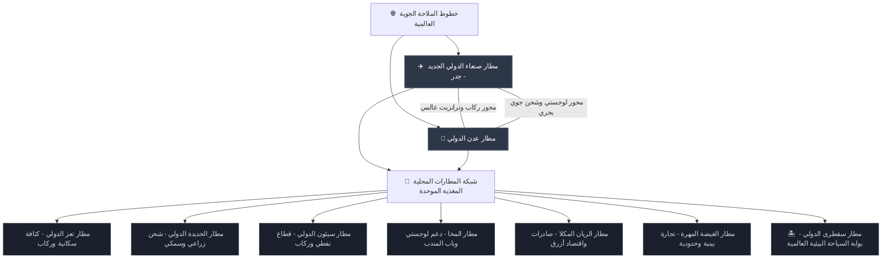
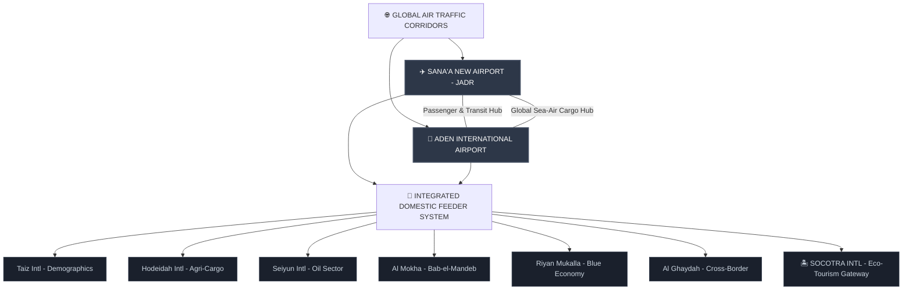

# 🗺️ الجمهورية اليمنية | مخطط نهضة قطاع الطيران المدني
> **الإطار الفني والمخطط الاستراتيجي الشامل لتحويل الأجواء والمطارات اليمنية إلى مراكز ملاحية عالمية**

---

## 🛑 قرار وتوجيه سيادي عاجل

* **المخطط الرئيسي وقائد المشروع:** المهندس أوسان عادل عبد الباري أحمد سلطان (`eng.AWSSN ADEL ABDULBARI AHMED SULTAN`)
* **الموعد النهائي الملزم للتشغيل:** 21 أغسطس 2026 (تنفيذ فوري وعاجل وبدون تأخير)
* **قاعدة التعاون الاستراتيجي:** تنسيق فني وتكاملي مطلق ولامشروط بين الهيئات والجهات الفنية وحكومتي صنعاء وعدن.

> [!CAUTION]
> **توجيه صارم لجميع القطاعات والإدارات الفنية:**
> تلبيةً للمصالح الاقتصادية والإنسانية العليا للشعب اليمني، تُؤمر جميع الهيئات الإدارية والسياسية والفنية في صنعاء وعدن بالعمل فوراً كجبهة فنية موحدة.
> 
> يجب تجاوز كافة العوائق البيروقراطية، واستكمال شروط السلامة الدولية، وتوقيع "اتفاقية تحييد الأجواء" المرفقة أدناه، ورفع الوثائق فوراً ومنتصف الليل إلى منظمتي **IATA** و**ICAO** قبل انتهاء يوم غدٍ **21 أغسطس 2026**.

---

## 📑 الجزء الأول: اتفاقية تحييد الأجواء والمطارات اليمنية
*الإطار الفني المشترك للتفعيل الفوري العاجل من قبل IATA و ICAO*

```gcode
=================================================================================
[البند الأول] وحدة إقليم معلومات الطيران (FIR)
             الأجواء اليمنية وحدة ملاحية واحدة لا تتجزأ، وتدار بالكامل عبر مركز 
             مراقبة جوية موحد ومتزامن سحابياً بين صنعاء وعدن.
=================================================================================
[البند الثاني] التحييد العسكري الكامل والحصانة
             يُحظر تماماً أي تواجد عسكري، أو مخازن سلاح، أو عمليات حربية داخل حرم 
             المطارات المدنية، وتُحصن مسارات الطيران من وسائل الحرب الإلكترونية.
=================================================================================
[البند الثالث] السيادة المالية واستقلالية العوائد
             تتمتع الهيئة العامة للطيران (CAMA) باستقلال مالي مطلق، وتُخصص 100% 
             من رسوم العبور والمسافرين لصيانة البنية التحتية وصرف مرتبات المهندسين.
=================================================================================
[البند الرابع] لجنة السلامة والأمن المشتركة (JSSC)
             إنشاء غرفة عمليات مشتركة للمراقبين والمهندسين الجويين من صنعاء وعدن 
             فوراً، مع تخصيص مقعد دائم لمراقب فني معتمد من منظمة (ICAO).
=================================================================================
```

---

## 🏗️ الجزء الثاني: قرية الشحن الجوي بمطار عدن الدولي (ACV)
### المواصفات الهندسية والفنية الدقيقة للمشروع

| المعيار الفني | المواصفات الهندسية | المستهدف التشغيلي |
| :--- | :--- | :--- |
| **الطاقة الاستيعابية السنوية** | 450,000 طن متري | سعة التخزين والفرز للمرحلة الأولى |
| **المساحة الإجمالية** | 250,000 متر مربع | بالجهة الشرقية لمحور مدرج مطار عدن |
| **الجسر البري السريع** | ممر لوجستي جمركي آمن | زمن نقل أقل من 20 دقيقة (الميناء ⇄ مطار عدن) |
| **صلابة ساحة الطائرات** | خرسانة مسلحة (تقييم PCN 85) | استيعاب 4 طائرات عملاقة (Boeing 747-8F) معاً |

### 🛠️ الأنظمة والمنشآت المتقدمة:
* **المستودع الرئيسي المؤتمت:** بمساحة 35,000 م² وبارتفاع صافي 14 متراً، مجهز بأنظمة التخزين والاسترجاع الآلي بالكامل (AS/RS).
* **بنية السلسلة الباردة:** بمساحة 8,000 م² مقسمة حرارياً لحفظ الأدوية والمستلزمات الطبية (2°C إلى 8°C) وتصدير الأسماك والأحياء البحرية (-20°C).
* **المصفوفة الجمركية الرقمية:** تفعيل نظام النافذة الموحدة المدعوم بالذكاء الاصطناعي لدمج الجمارك والزراعة والصحة لتخليص الشحنات خلال ساعتين كحد أقصى.

---

## 🌐 الجزء الثالث: المخطط الرئيسي (شبكة الربط المحوري الديناميكي)



### 🎯 التوزيع الاستراتيجي للمطارات المحورية:
1. **مطار صنعاء الجديد (جدر / بني الحارث):** المطار المحوري الأول لركاب الترانزيت والرحلات الطويلة العابرة للقارات عبر مدرجه الحديث بطول 4,000 متر.
2. **مطار عدن الدولي:** المركز اللوجستي الأول لإعادة الشحن الجوي والربط متعدد الوسائط مع خطوط الملاحة البحرية الدولية.
3. **المطارات المغذية (Spokes):** ترتبط برحلات مكوكية مستمرة لجمع الركاب والصادرات وضخها في المحورين الرئيسيين (صنعاء وعدن) للانطلاق عالمياً.

---

## ⚡ الجزء الرابع: خطة الطوارئ الزمنية الحاسمة للتشغيل

```yaml
جدول_الخطوات_التنفيذية: August21 2026 .... 21/08/2026
  من_الساعة_00_إلى_12:
    الإجراء_المطلوب: "توقيع وثيقة اتفاقية تحييد الأجواء والمطارات فوراً من القيادات السياسية والفنية في صنعاء وعدن."
    الحالة: "حرج للغاية"
  من_الساعة_12_إلى_24:
    الإجراء_المطلوب: "النشر الرقمي الفوري لخرائط المسارات الجوية المحدثة عبر تعميم الـ NOTAM الدولي لجميع الطيارين."
    الحالة: "إلزامي"
  ساعة_الصفر_المستهدفة:
    الإجراء_المطلوب: "الفتح الشامل للأجواء اليمنية وعودة حجز التذاكر التجارية الدولية وتفعيل عوائد رسوم العبور."
    الحالة: "بدء التشغيل الفعلي"
```

---

## ⚙️ الجزء الخامس: الخصائص التقنية للمستودع البرمجي
* **قالب ملف التجاهل `.gitignore`:** لغة `Python` (تم اختيارها لدعم برمجيات الذكاء الاصطناعي لتعديل مسارات الطيران والتوائم الرقمية للمطارات مستقبلاً).
* **رخصة المستودع `License`:** رخصة `MIT License` (الحرة والمرنة لضمان استخدام وتطوير الأكواد والمخططات من كافة الشركات العالمية والمؤسسات الحكومية بيسر وسهولة).

---
*تم الإعداد والصياغة تحت إشراف هندسي وفني سيادي لإعادة النهضة الاقتصادية للجمهورية اليمنية.*


---


# 🗺️ REPUBLIC OF YEMEN | AVIATION RESURRECTION BLUEPRINT
> **Sovereign Master Plan & Technical Framework for Transforming Yemeni Airspace into Global Hubs**

---

## 🛑 EMERGENCY SOVEREIGN INITIATIVE & DIRECTIVE

* **Chief Architect & Project Leader:** Eng. Osan Adel Abdulbari Ahmed Sultan (`eng.AWSSN ADEL ABDULBARI AHMED SULTAN`)
* **Mandatory Operational Deadline:** August 21, 2026 (Urgent & Immediate execution)
* **Strategic Collaboration Base:** Unconditional technical synchronization between the Authorities and Governments of Sana'a and Aden.

> [!CAUTION]
> **CRITICAL DIRECTIVE FOR ALL TECHNICAL DEPARTMENTS:**
> To serve the supreme economic and humanitarian interests of the Yemeni people, all administrative, political, and technical bodies in Sana'a and Aden are hereby strictly commanded to act as a unified technical front. 
> 
> You are required to immediately clear all bureaucratic barriers, finalize all global security alignments, execute the Airspace Neutralization Agreement below, and submit the final documentation to **IATA** and **ICAO** before the expiration of **August 21, 2026**.

---

## 📑 PART 1: AIRSPACE NEUTRALIZATION AGREEMENT
*Official Framework for Immediate IATA & ICAO Activation*

```gcode
=================================================================================
[RULE 01] Unified Flight Information Region (FIR)
          Yemeni airspace is declared a single, indivisible navigational unit 
          managed via a mirrored, cloud-synchronized Air Traffic Control matrix.
=================================================================================
[RULE 02] Total Demilitarization & Immunity
          Permanent prohibition of all military assets, storage, or tactical 
          installations within civil airport lines. Airspace is immune to warfare.
=================================================================================
[RULE 03] Fiscal Sovereignty & Ring-Fencing
          CAMA shall possess 100% financial autonomy. All overflight/landing fees 
          are legally locked to fund engineering payrolls and technical upgrades.
=================================================================================
[RULE 04] Joint Safety and Security Committee (JSSC)
          Immediate deployment of a combined ATC command center (Sana'a + Aden) 
          featuring a permanent desk for an active ICAO Technical Observer.
=================================================================================
```

---

## 🏗️ PART 2: ADEN AIR CARGO VILLAGE (ACV)
### Architectural & Engineering Technical Specifications

| Parameter | Technical Specification | Operational Target |
| :--- | :--- | :--- |
| **Annual Throughput** | 450,000 Metric Tons | Phase 1 Staging Capacity |
| **Geographical Area** | 250,000 Square Meters | East Runway Axis (Aden International) |
| **High-Speed Conduit** | Dedicated Logistics Corridor | < 20 Minutes Transit (Sea Port ⇄ Air Cargo) |
| **Pavement Rating** | Reinforced Concrete (PCN 85 Rating) | Holds 4 x Boeing 747-8F / Antonov An-124 simultaneously |

### 🛠️ Advanced Subsystems:
* **Automated Terminal Warehouse:** 35,000 m² footprint with a 14-meter vertical clearance engineered for Automated Storage and Retrieval Systems (AS/RS).
* **Cold-Chain Infrastructure:** 8,000 m² isolated thermal zones dynamically regulated for pharmaceutical security (2°C to 8°C) and advanced marine exports (-20°C).
* **Digital Customs Matrix:** Implementation of an AI-driven Single Window System integrating Customs, Agriculture, and Health inspection for a 2-hour maximum cargo clearance.

---

## 🌐 PART 3: THE MASTER PLAN (DYNAMIC NETWORK STRUCTURING)



### 🎯 Strategic Nodes Allocation:
1. **Sana'a New Airport (Jadr / Bani Al-Harith):** Re-engineered as the primary global Transit Hub, capturing transcontinental traffic via its advanced 4,000m runway.
2. **Aden International Airport:** The designated maritime-aviation logistics nexus for Africa, Europe, and the Middle East.
3. **Regional Spokes:** Interconnected via continuous regional shuttle operations to feed traffic directly into the Sana'a and Aden hubs.

---

## ⚡ PART 4: CRITICAL CRASH ACTION PLAN
August21 2026 .... 21/08/2026

```yaml
Timeline_Matrix:
  Hour_00_to_12:
    Action: "Executive signature of the Airspace Neutralization Agreement by leadership in Sana'a and Aden."
    Status: "CRITICAL"
  Hour_12_to_24:
    Action: "Immediate digital publication of updated aeronautical routing maps via international NOTAM bulletins."
    Status: "MANDATORY"
  Hour_24_Target:
    Action: "Official resumption of global commercial ticketing and active overflight billing cycles over Yemeni Skies."
    Status: "GO-LIVE"
```

---

## ⚙️ PART 5: REPOSITORY ARCHITECTURE
* **`.gitignore` Template:** `Python` (Enabling future integration of AI Flight Trajectory Optimization and Airport Digital Twins).
* **License:** `MIT License` (Permissive for unrestricted utilization by global engineering firms, international consortia, and official sovereign entities).

---
*Developed under strict technical and sovereign engineering oversight for the economic resurrection of the Republic of Yemen.*

